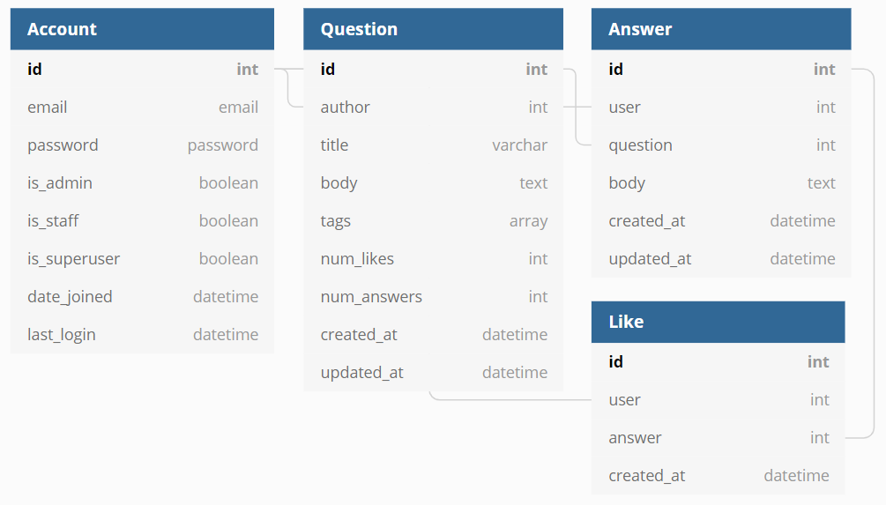

Simple Backend API of Quora clone

Users will be able to:
- Register for account and login (token authentication)
- Post/edit/delete questions
- Post/edit/delete answers
- Read questions and answers (no auth required)
- Like answer using a like button (and remove their like)

Pages:
- Main page with all the questions (with the author, date created, title and number of answers). The main page will only show the first 10 questions (pagination). The user can make a request for the next 10 questions.
- Page for viewing the question, along with all the answers for that question. The answer should include if the user has previously liked the question 
- Page for posting and editing a question
- Page for posting and editing an answer

Database design

